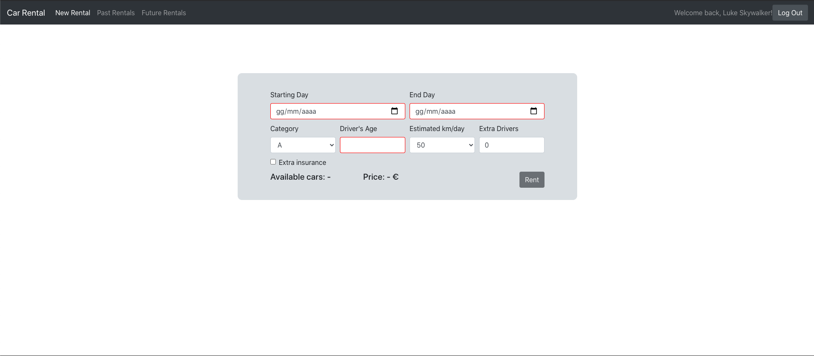

# Exam #1: "Noleggio Veicoli"
## Student: s270264 FARINA GIANDONATO 

## React client application routes

- Route `/`: list of all vehicles with interactive filters
- Route `/login`: login page where user can authenticate itself
- Route `/newrental`: interactive configurator which shows the number of available vehicles. User can rent one of them.
- Route `/pastrentals`: list of all past rentals fo the user
- Route `/futurerentals`: list of all future rentals of the user that can delete them directly from the table

## REST API server

- POST `/api/login`
  - request body: object with a username and password
  - response body: object with id and name of the user or the error message
- POST `/api/logout`
  - request body: /
  - response body: /
- GET `/api/cars`
  - request parameters: /
  - response body: array with cars information or object with error
- GET `/api/categories`
  - request parameters: /
  - response body: array with categories or object with error
- GET `/api/brands`
  - request parameters: /
  - response body: array with brands or object with error
- GET `/api/user`
  - request parameters: /
  - response body: object with id and name of the user or the error messageobject with id and name of the user or the error message
- GET `/api/configurator`
  - request parameters: all need information of a new rental with the query syntax (`?param1=value1&param2=value2 ...`)
  - response body: object with available vehicles, price and the first car available or object with error
- POST `/api/logout`
  - request body: object with payment information 
  - response body: object with errors, if there are any
- POST `/api/newrental`
    - request body: all information about the new rental except the user (see table rentals below)
    - response body: object with errors, if there are any
- GET `/api/pastrentals`
  - request body: /
  - response body: array of object describing a past rental or object with error
- GET `/api/futurerentals`
  - request body: /
  - response body: array of object describing a future rental or object with error
- DELETE `/api/rental`
  - request parameters: car id and starting day of a rental with the query syntax (`?param1=value1&param2=value2 ...`)
  - response body: object with errors, if there are any

## Server database

- Table `users` - contains id(PK) name email hash
- Table `cars` - contains id(PK) category brand model
- Table `rentals` - contains cid(PK), uid(PK), startingDay(PK), endDay, extraDrivers, extraInsurace, age, distance 

(PK) = Primary key, cid = car id, uid = user id 

## Main React Components

- `MyNavbar` (in `Navbar.js`): Navbar with links to the various routes (changing if user is logged in or not)
- `Cars` (in `Cars.js`): manage the vehicle list and its filters, updating the state and requiring info to the server
- `PastRentalsTable` (in `PastRentals.js`): requires info about past rentals to the server and shows them
- `FutureRentalsTable` (in `FutureRentals.js`): requires info about future rentals to the server and shows them. It manages also the cancellation of future rentals
- `RentalForm` (in `NewRental.js`): form where the user can insert the parameters for a new and after checks, this component requires info to the server
- `PaymentForm` (in `NewRental.js`): form where the user can insert the payment data that will be sent to the server. If they are ok, it adds a new rental
- `LoginPage` (in `LoginPage.js`): manages the authentication of users and shows possible errors

## Screenshot

## Test users

* luke.skywalker@email.com, password
* john.smith@email.com, newyork
* james.holden@email.com, rocinante (frequent customer)
* tony.stark@email.com, jarvis
* james.bond@email.com, 007 (frequent customer)
